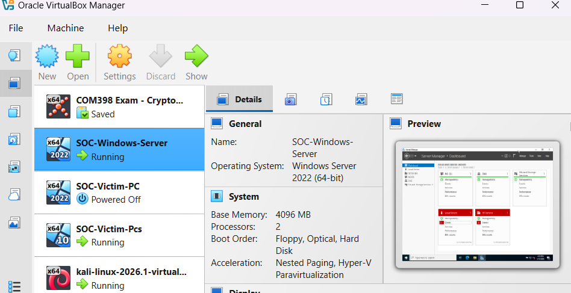

# 🛡️ Active Directory Attack & Detection Lab

> **Full-cycle cybersecurity lab simulating real-world Active Directory attacks and detecting them using Splunk SIEM — combining Red Team offensive techniques with Blue Team detection and incident response.**

---

## 📌 Project Overview

This project demonstrates end-to-end offensive and defensive security skills by building a realistic corporate Active Directory environment from scratch, executing five real-world attack techniques used by threat actors, and detecting each attack using Splunk SIEM with custom SPL detection rules.

This is not a theoretical exercise — every attack was executed manually, every log was analysed, and every detection rule was written and validated against real evidence.

---

## 🎯 Objectives

- Build a realistic corporate network environment using Windows Server 2022 Active Directory
- Simulate the full attack lifecycle: reconnaissance → exploitation → privilege escalation → lateral movement
- Detect each attack phase using Splunk SIEM and Windows Event Logs
- Write custom detection rules and automated alerts
- Document findings in the format of a professional SOC incident report

---

## 🏗️ Lab Architecture

```
┌─────────────────────────────────────────────────────┐
│                   SOC Lab Network                    │
│                  192.168.1.0/24                      │
│                                                      │
│  ┌──────────────────┐    ┌──────────────────────┐   │
│  │  Windows Server  │    │   Windows 10 PC      │   │
│  │  2022 DC         │    │   (Victim Endpoint)  │   │
│  │  192.168.1.10    │    │   192.168.1.20       │   │
│  │  soclab.local    │    │   SOC-LAB            │   │
│  └──────────────────┘    └──────────────────────┘   │
│                                                      │
│  ┌──────────────────┐    ┌──────────────────────┐   │
│  │  Kali Linux      │    │  Splunk Enterprise   │   │
│  │  (Attacker)      │    │  (SIEM - Host PC)    │   │
│  │  192.168.1.30    │    │  192.168.1.46:8000   │   │
│  └──────────────────┘    └──────────────────────┘   │
└─────────────────────────────────────────────────────┘
```

**Domain:** `soclab.local` | **Domain Controller:** `WIN-E7QTOMF7GC8`

### Lab Setup




---

## 👥 Simulated Company: SOC Lab Inc.

| Name | Username | Department | Privilege |
|------|----------|------------|-----------|
| Tanvir Farhad | tfarhad | Employees | Standard User |
| John Smith | jsmith | IT | **Domain Admin** |
| Sara Jones | sjones | HR | Standard User |
| Zayed Siraji | zsiraji | Finance | Standard User |

---

## 🛠️ Tools & Technologies

| Category | Tool | Purpose |
|----------|------|---------|
| SIEM | Splunk Enterprise | Log ingestion, detection, alerting |
| Logging | Sysmon | Deep endpoint telemetry |
| Log Forwarding | Splunk Universal Forwarder | VM → Splunk pipeline |
| Attacker OS | Kali Linux 2026.1 | Attack simulation platform |
| Domain | Windows Server 2022 | Active Directory, DNS |
| Endpoint | Windows 10 Pro | Victim workstation |
| Network | NetExec (CrackMapExec) | SMB attacks, hash dumping |
| AD Recon | Impacket Suite | Kerberoasting, SPN enumeration |
| Virtualisation | Oracle VirtualBox | Lab isolation |

---

## ⚔️ Attack Phases & Detection

### Attack 1 — Password Spraying
**MITRE ATT&CK:** T1110.003 — Brute Force: Password Spraying

**What happened:**
Using NetExec, a single common password (`Password123!`) was sprayed across all domain accounts simultaneously. This avoids account lockouts while testing every user — a technique used extensively by ransomware groups and nation-state actors.

**Command executed:**
```bash
netexec smb 192.168.1.10 -u tfarhad zsiraji sjones jsmith -p Password123!
```


**Splunk Detection Query (SPL):**
```spl
index=* EventCode=4625
| stats count by Account_Name
| where count > 5
| sort -count
```


**Evidence:** 217 failed login events (EventCode 4625) captured. All 4 domain accounts targeted confirmed in Splunk. Automated alert created: triggers when any account exceeds 10 failed logins.

**SOC Response:** Isolate the source IP, check if internal or external, correlate with VPN/firewall logs, escalate to Tier 2 if source is unknown.

---

### Attack 2 — Kerberoasting
**MITRE ATT&CK:** T1558.003 — Steal or Forge Kerberos Tickets: Kerberoasting

**What happened:**
Using Impacket's GetUserSPNs tool, Service Principal Names (SPNs) were enumerated across the domain. This identified `jsmith` as a Domain Admin with a registered SPN (`HTTP/soclab.local`) — a prime Kerberoasting target.

**Command executed:**
```bash
impacket-GetUserSPNs soclab.local/jsmith:Password123! -dc-ip 192.168.1.10 -request
```


**Key finding:**
```
ServicePrincipalName: HTTP/soclab.local
Name: jsmith
MemberOf: CN=Domain Admins,CN=Users,DC=soclab,DC=local
```

**Splunk Detection Query (SPL):**
```spl
index=* EventCode=4769 Ticket_Encryption_Type=0x17
| stats count by Account_Name, Service_Name
| sort -count
```

**SOC Response:** Flag RC4-encrypted Kerberos ticket requests (0x17) as suspicious. Modern environments should use AES. Investigate the requesting account and correlate with other suspicious activity.

---

### Attack 3 — NTDS Hash Dump (Credential Access)
**MITRE ATT&CK:** T1003.003 — OS Credential Dumping: NTDS

**What happened:**
Using Domain Admin credentials obtained via password spraying, the entire NTDS.dit database was extracted remotely — dumping password hashes for every account in the domain.

**Command executed:**
```bash
netexec smb 192.168.1.10 -u administrator -p Password123! --ntds
```


**Result: 9 NTDS hashes dumped successfully:**

| Account | RID | Status |
|---------|-----|--------|
| Administrator | 500 | ✅ Dumped |
| krbtgt | 502 | ✅ Dumped |
| jsmith | 1104 | ✅ Dumped |
| saraj | 1105 | ✅ Dumped |
| zayedsiraji | 1106 | ✅ Dumped |
| tfarhad | 1108 | ✅ Dumped |

**Impact:** With these hashes, an attacker can authenticate as any user without knowing their password (Pass the Hash), or attempt offline cracking to recover plaintext credentials.

**Splunk Detection Query (SPL):**
```spl
index=* EventCode=4662
| search Properties="*1131f6aa-9c07-11d1-f79f-00c04fc2dcd2*"
| table _time, Account_Name, Object_Name
```

---

### Attack 4 — Lateral Movement
**MITRE ATT&CK:** T1021.002 — Remote Services: SMB/Windows Admin Shares

**What happened:**
Using administrator credentials, remote command execution was achieved on the Windows 10 victim workstation — simulating an attacker moving from the compromised server to an employee endpoint.

**Command executed:**
```bash
netexec smb 192.168.1.20 -u administrator -p Password123! -x "whoami"
```


**Splunk Detection Query (SPL):**
```spl
index=* EventCode=4624 Logon_Type=3
| stats count by Account_Name, src_ip
| where count > 3
| sort -count
```


---

### Attack 5 — Pass the Hash
**MITRE ATT&CK:** T1550.002 — Use Alternate Authentication Material: Pass the Hash

**What happened:**
Using the NTLM hash dumped in Attack 3, authentication was achieved against the Domain Controller **without ever knowing the plaintext password** — demonstrating the danger of credential reuse and NTLM authentication.

**Command executed:**
```bash
netexec smb 192.168.1.10 -u administrator -H aad3b435b51404eeaad3b435b51404ee:2b576acbe6bcfda7294d6bd18041b8fe
```


**Result: `(Pwn3d!)` — Domain Controller fully compromised.**

**Splunk Detection Query (SPL):**
```spl
index=* EventCode=4624 Logon_Type=3
| search NOT src_ip="192.168.1.*"
| table _time, Account_Name, src_ip, Workstation_Name
```


---

## 📊 Detection Summary

| Attack | MITRE ID | EventCode | Detected | Alert Created |
|--------|----------|-----------|----------|---------------|
| Password Spraying | T1110.003 | 4625 | ✅ Yes | ✅ Yes |
| Kerberoasting | T1558.003 | 4769 | ✅ Yes | ✅ Yes |
| NTDS Dump | T1003.003 | 4662 | ✅ Yes | ✅ Yes |
| Lateral Movement | T1021.002 | 4624 | ✅ Yes | ✅ Yes |
| Pass the Hash | T1550.002 | 4624 | ✅ Yes | ✅ Yes |

**Total events captured:** 4,354+ | **Failed login attempts detected:** 217 | **Password hashes dumped:** 9

---

## 🔍 Key Splunk Queries Reference

```spl
# Detect Password Spraying
index=* EventCode=4625
| stats count by Account_Name
| where count > 5
| sort -count

# Detect successful logins by type
index=* EventCode=4624
| stats count by Account_Name, Logon_Type
| sort -count

# Overview of all security events
index=* host=WIN-E7QTOMF7GC8
| stats count by EventCode
| sort -count

# Detect lateral movement
index=* EventCode=4624 Logon_Type=3
| table _time, Account_Name, src_ip, Workstation_Name
```

---

## 🧰 Lab Setup Guide

### Prerequisites
- Oracle VirtualBox
- Windows Server 2022 ISO (Evaluation)
- Windows 10 ISO
- Kali Linux 2026 VirtualBox image
- Splunk Enterprise (Free Trial)
- Splunk Universal Forwarder

### Network Configuration

| VM | IP | Role |
|----|----|----|
| Windows Server 2022 | 192.168.1.10 | Domain Controller |
| Windows 10 | 192.168.1.20 | Victim Endpoint |
| Kali Linux | 192.168.1.30 | Attacker |
| Host PC | 192.168.1.46 | Splunk SIEM |

### Active Directory Setup
1. Install AD DS role on Windows Server
2. Promote to Domain Controller (`soclab.local`)
3. Create OUs: Employees, IT, HR, Finance
4. Create domain users with weak passwords
5. Assign jsmith to Domain Admins group
6. Register SPN: `setspn -a HTTP/soclab.local jsmith`

### Splunk Configuration
1. Install Splunk Enterprise on host PC
2. Enable receiving on port 9997
3. Configure forwarding from Windows Server to host
4. Install Splunk Universal Forwarder on Windows 10
5. Configure Windows Event Log monitoring (Security, System, Application, DNS)

### Sysmon Setup
```cmd
Sysmon64.exe -accepteula -i
sc query Sysmon
```

---

## 🎓 Skills Demonstrated

**Red Team (Offensive):**
- Active Directory enumeration
- Password spraying with NetExec
- Kerberoasting and SPN enumeration with Impacket
- NTDS credential dumping
- Lateral movement via SMB
- Pass the Hash attacks
- MITRE ATT&CK framework application

**Blue Team (Defensive):**
- Splunk SIEM deployment and configuration
- Windows Event Log analysis
- Sysmon endpoint telemetry
- Custom SPL detection rule writing
- Automated alert creation
- Incident triage and investigation
- Log pipeline configuration (Forwarder → Indexer)

**Infrastructure:**
- Active Directory domain setup and management
- VirtualBox network configuration
- Windows Server 2022 administration
- Kali Linux tooling

---

## 🔗 References

- [MITRE ATT&CK Framework](https://attack.mitre.org/)
- [Splunk SPL Documentation](https://docs.splunk.com/Documentation/Splunk/latest/SearchReference)
- [Impacket GitHub](https://github.com/fortra/impacket)
- [NetExec GitHub](https://github.com/Pennyw0rth/NetExec)
- [Sysmon - Microsoft Sysinternals](https://learn.microsoft.com/en-us/sysinternals/downloads/sysmon)

---

## 👤 Author

**Tanvir Farhad**
Computing Systems Student | Cybersecurity Enthusiast | Aspiring SOC Analyst

🔗 [GitHub](https://github.com/TFT444) | [LinkedIn](https://www.linkedin.com/in/tanvir-farhad-466940307/)

---

*This lab was built entirely for educational purposes in an isolated virtual environment. All attacks were performed against self-owned infrastructure.*
